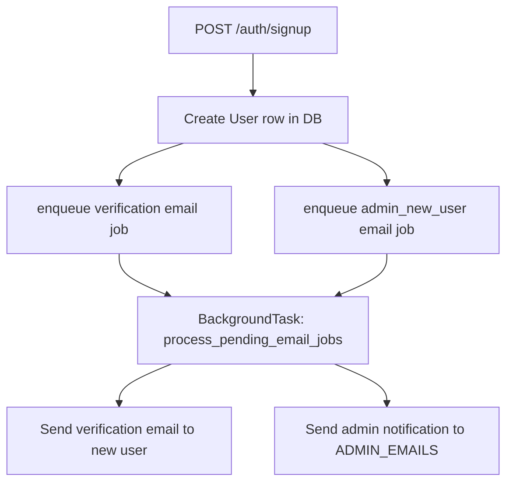

# User authentication

## Overview

The dashboard (user-facing web app) uses email/password authentication with a signed session cookie. Users sign up, optionally verify their email, and log in; some actions require a verified email.

## Flow

1. **Signup:** `POST /auth/signup` — Creates a user (email, hashed password, plan). Subject to per-IP rate limits and a global daily cap: if the number of users created in the last 24 hours reaches `XRAYRADAR_MAX_SIGNUPS_PER_DAY` (default **100**; set to `0` for no limit), signup returns **503** with a user-facing message: "We've reached our daily signup limit. Please try again tomorrow."
2. **Signup status:** `GET /auth/signup-status` — Returns `{ "allowed": true }` or `{ "allowed": false, "message": "We've reached our daily signup limit. Please try again tomorrow." }` so the UI can show the message before the user submits the form. Sets `xrayradar_user_session` cookie and enqueues two background email jobs: `verification` (to the user) and `admin_new_user` (to admin recipients from `XRAYRADAR_ADMIN_EMAILS`). Supported plans are `Free`, `Basic`, `Teams`, and `Teams Pro`.
3. **Login:** `POST /auth/login` — Validates credentials, updates `last_login_at`, sets `xrayradar_user_session` cookie.
4. **Session:** Protected routes use the cookie to resolve the user via `require_user` (reads `get_user_session_email`, loads `User` from DB).
5. **Verified user:** Sensitive actions (e.g. token requests, deletion request) use `require_verified_user`; unverified users get 403 with a message to verify email.
6. **Verify email:** `GET /auth/verify-email?token=...` — One-time link from email; sets `User.email_verified = True` and clears `verification_token`, and sets `xrayradar_user_session` so the user is logged in (no need to sign in again; “Go to dashboard” works). On first successful verification, a one-time onboarding email (“getting started in 3 steps”) is enqueued and sent in the background (see [Onboarding](onboarding.md)).
7. **Resend verification:** `POST /auth/resend-verification` — Requires login; sends a new verification email in the background.
8. **Forgot password:** `POST /auth/forgot-password` — Accepts `{ "email": "..." }`. If user exists, generates a secure token, sets `password_reset_token` and `password_reset_expires_at` (1 hour), and sends a reset email via Resend. Always returns 200 with a generic message to avoid email enumeration.
9. **Reset password:** `POST /auth/reset-password` — Accepts `{ "token": "...", "new_password": "..." }`. Validates token and expiry, updates `password_hash`, clears token and expiry. Returns 400 for invalid/expired token.
10. **Logout:** `POST /auth/logout` — Clears `xrayradar_session` and `xrayradar_user_session` cookies.
11. **Current user:** `GET /api/me` — When authenticated, returns the logged-in user (id, email, plan, email_verified, created_at). When unauthenticated, returns `200` with body `null` (no 401), so the marketing site can check auth without failing. Implemented via optional user dependency (`get_optional_user`).

## Key components

- **Router:** `src/xrayradar_server/routers/user_auth.py` — signup, login, logout, verify-email, resend-verification, forgot-password, reset-password, `/api/me`
- **Auth helpers:** `src/xrayradar_server/auth.py` — `hash_password`, `verify_password`, `get_session_serializer`, `get_user_session_email`, `cookie_secure`
- **Deps:** `src/xrayradar_server/deps.py` — `require_user`, `require_verified_user`, `get_optional_user` (returns `None` when unauthenticated; used by `/api/me`).
- **Models:** `src/xrayradar_server/models.py` — `User` (email, password_hash, plan, email_verified, verification_token, password_reset_token, password_reset_expires_at, last_login_at)
- **Config:** `XRAYRADAR_SESSION_SECRET` (session signing), `RESEND_API_KEY` / `RESEND_FROM_EMAIL` / `XRAYRADAR_BASE_URL` (verification and password reset emails), `XRAYRADAR_MAX_SIGNUPS_PER_DAY` (global cap, default 100; 0 = no limit; rolling 24-hour window)

## Signup email job data flow

- **Queue + worker:** `src/xrayradar_server/mail_jobs.py` enqueues and delivers both jobs.
- **Admin recipients source:** `src/xrayradar_server/constants.py` parses `XRAYRADAR_ADMIN_EMAILS` into `ADMIN_EMAILS`.

## Related

- [Onboarding](onboarding.md) — Getting started guidance in the dashboard and post-verification email
- [Email alerts](email-alerts.md) — Resend is also used for error alerts
- [Account deletion](account-deletion.md) — Deletion request requires verified user
