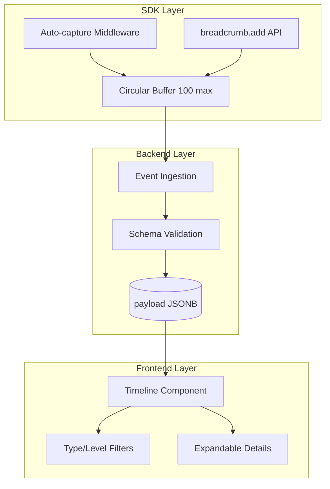

# Breadcrumbs

## Overview

Breadcrumbs capture a trail of events that occurred before an error, providing context for debugging. They help developers understand the sequence of user actions, network requests, and system events that led to an exception.

## Architecture

```
┌─────────────────────────────────────────────────────────────────────┐
│                    Python SDK (xrayradar)                            │
│  ┌────────────────────────────────────────────────────────────────┐ │
│  │  Django/FastAPI/Flask Middleware                               │ │
│  │  • Auto-clears breadcrumbs on each request                     │ │
│  │  • Auto-captures HTTP request breadcrumb                       │ │
│  │  • tracker.add_breadcrumb() for manual breadcrumbs             │ │
│  └────────────────────────────────────────────────────────────────┘ │
│                              │                                       │
│                              │ Circular buffer (max 100)            │
│                              ▼                                       │
│  ┌────────────────────────────────────────────────────────────────┐ │
│  │  tracker.capture_exception(e)                                  │ │
│  │  Attaches all breadcrumbs to event payload                     │ │
│  └────────────────────────────────────────────────────────────────┘ │
└─────────────────────────────────────────────────────────────────────┘
                              │
                              │ HTTP POST /api/{project_id}/store/
                              ▼
┌─────────────────────────────────────────────────────────────────────┐
│                    Backend (XrayRadar)                             │
│  ┌────────────────────────────────────────────────────────────────┐ │
│  │  Event Ingestion (routers/api.py)                              │ │
│  │  • Validates BreadcrumbIn schema                               │ │
│  │  • Normalizes breadcrumbs:                                     │ │
│  │    - Limits to 100 most recent                                 │ │
│  │    - Truncates messages > 1024 chars                           │ │
│  │    - Adds default type/level                                   │ │
│  └────────────────────────────────────────────────────────────────┘ │
│                              │                                       │
│                              ▼                                       │
│  ┌────────────────────────────────────────────────────────────────┐ │
│  │  Storage: Event.payload (JSONB column)                         │ │
│  │  { "breadcrumbs": [...], "exception": {...}, ... }             │ │
│  └────────────────────────────────────────────────────────────────┘ │
└─────────────────────────────────────────────────────────────────────┘
                              │
                              │ GET /api/user/projects/{id}/events/{event_id}
                              ▼
┌─────────────────────────────────────────────────────────────────────┐
│                    Frontend (xrayradar-web)                          │
│  ┌────────────────────────────────────────────────────────────────┐ │
│  │  EventDetailView.jsx                                           │ │
│  │  └─ BreadcrumbTimeline.jsx                                     │ │
│  │     • Chronological timeline display                           │ │
│  │     • Type icons (http, ui, navigation, error, etc.)           │ │
│  │     • Level color-coding (debug, info, warning, error)         │ │
│  │     • Relative timestamps ("5s before error")                  │ │
│  │     • Expandable data sections                                 │ │
│  │     • Sort toggle (oldest/newest first)                        │ │
│  └────────────────────────────────────────────────────────────────┘ │
└─────────────────────────────────────────────────────────────────────┘
```

### Flow diagram (Mermaid)



## Data Model

### BreadcrumbIn Schema

```python
class BreadcrumbIn(BaseModel):
    timestamp: Optional[datetime] = None
    type: str = "default"      # default, http, navigation, ui, console, error, query, user
    category: Optional[str] = None
    message: Optional[str] = None
    level: str = "info"        # debug, info, warning, error
    data: Optional[dict[str, Any]] = None
```

### Breadcrumb Types

| Type | Description | Auto-captured By |
|------|-------------|------------------|
| `default` | Generic breadcrumb | Manual |
| `http` | HTTP requests | Django/FastAPI/Flask middleware |
| `navigation` | Page/route changes | Manual (future: JS SDK) |
| `ui` | User interactions (e.g. clicks) | Manual: `add_breadcrumb(type="ui", ...)` when backend handles the action; real DOM capture requires JS SDK |
| `console` | Log/console output | **Logging integration** with `capture_as_breadcrumbs=True` (Python logging → breadcrumbs); browser console requires JS SDK |
| `error` | Caught errors | Manual |
| `query` | Database queries | Manual (future: ORM hooks) |
| `user` | Custom user actions | Manual |

### Breadcrumb Levels

| Level | Color | Description |
|-------|-------|-------------|
| `debug` | Gray | Verbose debugging info |
| `info` | Blue | Normal informational events |
| `warning` | Yellow | Potential issues |
| `error` | Red | Error-level events |

## Backend Implementation

### Validation (schemas.py)

The `BreadcrumbIn` schema validates each breadcrumb entry:
- `timestamp` is optional (SDK may add it)
- `type` defaults to "default"
- `level` defaults to "info"
- `message` and `data` are optional

### Normalization (routers/api.py)

The `normalize_breadcrumbs()` function processes breadcrumbs before storage:

```python
MAX_BREADCRUMBS = 100
MAX_BREADCRUMB_MESSAGE_LENGTH = 1024

def normalize_breadcrumbs(event: dict) -> dict:
    # 1. Limit to most recent 100 breadcrumbs
    # 2. Truncate messages > 1024 chars with "..."
    # 3. Add default type/level if missing
    # 4. Skip non-dict entries
```

### Storage

Breadcrumbs are stored in the `payload` JSONB column of the `events` table, alongside other event data:

```json
{
  "breadcrumbs": [
    {
      "timestamp": "2026-01-27T12:30:45Z",
      "type": "http",
      "category": "api",
      "message": "GET /api/users",
      "level": "info",
      "data": {"status_code": 200, "duration_ms": 45}
    },
    {
      "timestamp": "2026-01-27T12:30:46Z",
      "type": "ui",
      "message": "User clicked submit",
      "level": "info"
    }
  ],
  "exception": {...},
  "message": "...",
  ...
}
```

## Frontend Implementation

### BreadcrumbTimeline Component

**Location:** `xrayradar-web/src/components/BreadcrumbTimeline.jsx`

**Features:**
- Displays breadcrumbs in chronological order (with toggle)
- Shows type-specific icons
- Color-codes by level
- Calculates relative time ("5s before error")
- Expands to show `data` when clicked
- Shows count and sort toggle in header

**Props:**
- `breadcrumbs` - Array of breadcrumb objects
- `errorTimestamp` - Event timestamp for relative time calculation

### Relative Time Display

The component calculates time relative to the error:
- "just before" - < 1 second
- "Xs before" - < 60 seconds
- "Xm before" - < 60 minutes
- "Xh before" - >= 60 minutes

### Empty State

When no breadcrumbs exist, displays: "No breadcrumbs recorded for this event."

## Python SDK Usage

### Automatic Breadcrumbs (Middleware)

**Django:**
```python
# settings.py
MIDDLEWARE = [
    'xrayradar.integrations.django.ErrorTrackerMiddleware',
    # ... other middleware
]
```

**FastAPI:**
```python
from xrayradar import ErrorTracker
from xrayradar.integrations.fastapi import FastAPIIntegration

tracker = ErrorTracker(dsn="...", auth_token="...")
FastAPIIntegration.init_app(app, tracker)
```

**Flask:**
```python
from xrayradar import ErrorTracker
from xrayradar.integrations.flask import FlaskIntegration

tracker = ErrorTracker(dsn="...", auth_token="...")
FlaskIntegration.init_app(app, tracker)
```

### Manual Breadcrumbs

```python
tracker.add_breadcrumb(
    message="User clicked checkout",
    category="ui",
    level="info",
    data={"cart_total": 99.99, "items": 3}
)
```

### Configuration

```python
tracker = ErrorTracker(
    dsn="...",
    auth_token="...",
    max_breadcrumbs=100  # Default: 100
)
```

## Performance Considerations

### Memory
- SDK maintains circular buffer of max 100 breadcrumbs per request
- Breadcrumbs are cleared at start of each HTTP request

### Storage
- Breadcrumbs stored in JSONB, not indexed separately
- Long messages truncated to 1024 chars
- No separate database queries for breadcrumbs

### UI
- Frontend timeline limited to scrollable container (350px max height)
- Expandable data sections load on demand
- Relative timestamps calculated once on render

## Testing

### Backend Tests
**File:** `tests/test_breadcrumbs.py`

- Schema validation tests
- Normalization tests (limit, truncation, defaults)
- Edge cases (non-dict entries, empty strings)

### Frontend Tests
**File:** `xrayradar-web/src/components/BreadcrumbTimeline.test.jsx`

- Empty state rendering
- Breadcrumb display (types, levels, timestamps)
- Sort toggle functionality
- Expand/collapse data sections
- Relative time calculation

## Future Enhancements

1. **Console breadcrumbs** - Capture console.log/warn/error in JS SDK
2. **DOM event breadcrumbs** - Capture clicks, form inputs in JS SDK
3. **Database query breadcrumbs** - ORM integration for Django/SQLAlchemy
4. **Breadcrumb filtering** - Filter by type/level in UI
5. **Breadcrumb search** - Search across events by breadcrumb content

## Related Documentation

- [Event Ingestion](./event-ingest.md) - How events are stored
- [Dashboard Stats](./dashboard-stats.md) - Error analytics
- [Email Alerts](./email-alerts.md) - Error notifications
