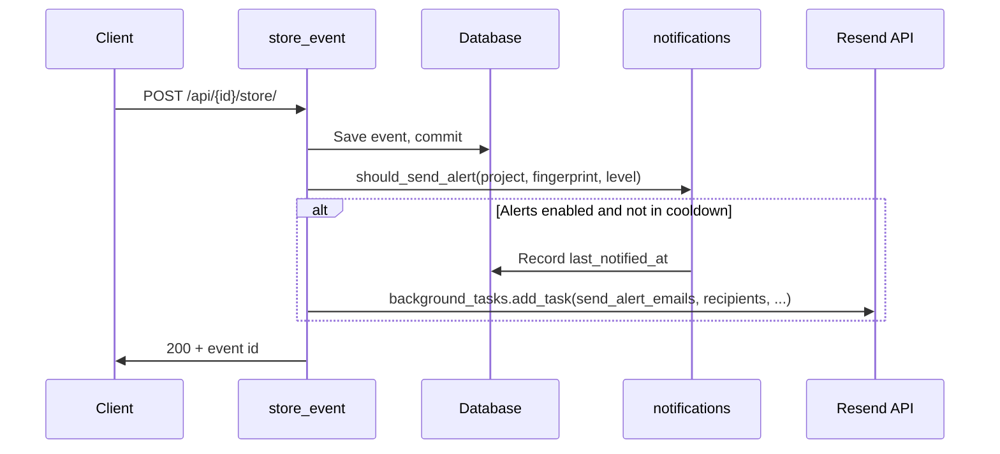

# Email alerts for errors

## Overview

When an error-level event is stored and the project has email alerts enabled, the project owner and any additional configured recipients receive an email via the Resend API. Alerts are subject to a per-fingerprint cooldown to avoid flooding.

## Architecture

- **Non-blocking:** Use FastAPI `BackgroundTasks` so ingest response is not delayed by Resend. No new queue/worker.

## Recipients

- **Project owner** — `User.email` for the user who owns the project (`Project.owner_user_id`).
- **Additional emails** — Stored in `project_alert_recipients`; deduplicated with owner so no one is emailed twice.

## Components

- **Trigger:** `store_event` in `src/xrayradar_server/routers/api.py` (after commit, via `BackgroundTasks`).
- **Logic:** `src/xrayradar_server/notifications.py` — `get_alert_recipients`, `should_send_alert`, `send_alert_emails`.
- **Config:** `RESEND_API_KEY`, `RESEND_FROM_EMAIL`; if key is unset, sending is a no-op.
- **Settings:** Per-project in `project_alert_settings` (enabled, level_filter, cooldown_minutes) and `project_alert_recipients`.

## Plan limits

- **Free:** No email alerts. `get_alert_recipients` returns no one for projects owned by a Free user; GET alert-settings returns `enabled=False`, `min_cooldown_minutes=None`; PATCH with `enabled=True` returns 400.
- **Basic:** Email alerts allowed; minimum cooldown **10 minutes**.
- **Teams / Teams Pro:** Email alerts allowed; minimum cooldown **1 minute**.

## User API

- `GET /api/user/projects/{project_id}/alert-settings` — read enabled, cooldown, additional_emails.
- `PATCH /api/user/projects/{project_id}/alert-settings` — update settings and additional recipients.
