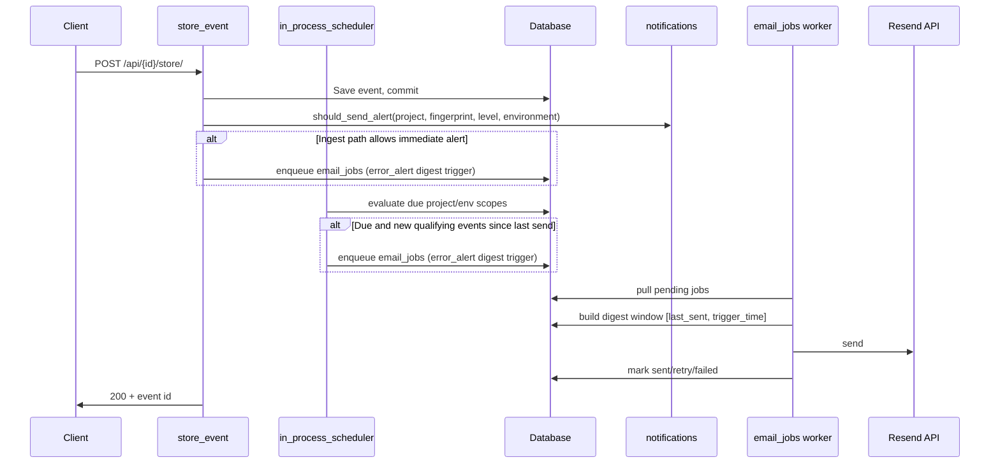
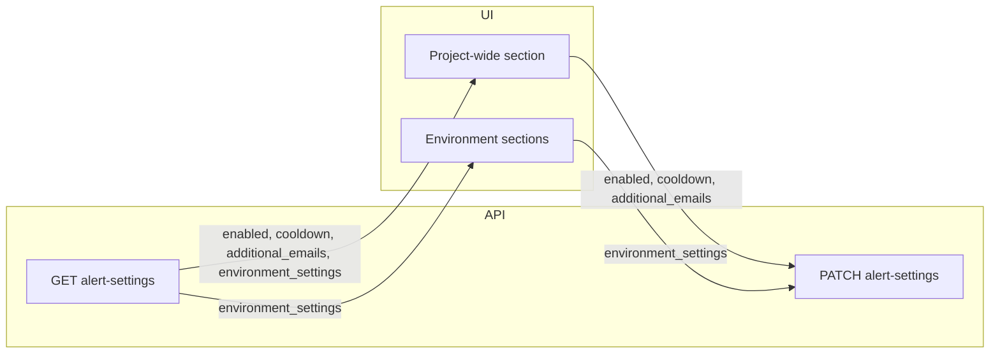

# Email alerts for errors

## Overview

When an error-level event is stored and the project has email alerts enabled, recipients are resolved (owner + configured recipients), and a digest email job is queued for delivery. Alerts are subject to cooldown controls to avoid flooding, including optional environment-level overrides.

Alert timing is now evaluated by a periodic in-process scheduler pass in the web app lifecycle, so due digest emails can be queued even if no fresh event arrives exactly when cooldown expires.

## Architecture

- **Non-blocking and durable:** Ingest enqueues DB jobs; a worker processes jobs with retry/backoff.
- **Digest semantics:** one alert email per cooldown window (per project trigger), addressed to all configured recipients in a single send.
- **Exclusive scopes:** project-level scope only evaluates unclaimed events (no environment, or environments without their own enabled env alert settings). Events in enabled env scopes (for example `development`) are owned by that env scope and excluded from project-level digests.
- **Dedupe:** Ingest and scheduler share a 90-second enqueue debounce per project/environment; a second enqueue within that window is skipped. Empty digests (no issues in the window) are never sent.
- **Logging semantics:** delivery outcomes are still logged per recipient in `email_log` for auditing and admin stats.

## Recipients

- **Project owner** — `User.email` for the user who owns the project (`Project.owner_user_id`).
- **Additional emails** — Stored in `project_alert_recipients`; deduplicated with owner.
- **Environment recipients (optional)** — Stored in `project_alert_environment_recipients` and merged for matching environment.

## Components

- **Trigger:** `store_event` in `src/xrayradar_server/routers/api.py` (enqueue after commit).
- **Logic:** `src/xrayradar_server/notifications.py` — `get_alert_recipients`, `should_send_alert`.
- **Queue/worker:** `src/xrayradar_server/mail_jobs.py` — enqueue + processing + retry.
- **Scheduler:** `src/xrayradar_server/alert_scheduler.py` — periodic due-check evaluator; run in-process from app lifespan (optionally callable via `scripts/run_alert_scheduler_once.py`).
- **Digest aggregation:** `src/xrayradar_server/notifications.py` — `get_last_alert_sent_at`, `get_top_issues_since`.
- **Settings:** Project-level (`project_alert_settings`, `project_alert_recipients`) plus optional env-level (`project_alert_environment_settings`, `project_alert_environment_recipients`).

## UI Data Flow

The settings UI now separates project-wide and environment-specific alert configuration and persists both in a single PATCH payload:

## Plan limits

- **Free:** No email alerts. `get_alert_recipients` returns no one for projects owned by a Free user; GET alert-settings returns `enabled=False`, `min_cooldown_minutes=None`; PATCH with `enabled=True` returns 400.
- **Basic:** Email alerts allowed (project-level only); minimum cooldown **10 minutes**. Environment-specific alert settings are not available.
- **Teams / Teams Pro:** Email alerts allowed; minimum cooldown **1 minute**. Environment-specific alert settings (env-level enabled, cooldown, recipients) are available; only these plans can access or configure `environment_settings` in GET/PATCH alert-settings.

## User API

- `GET /api/user/projects/{project_id}/alert-settings` — read project and environment-level alert settings (**owner only**).
- `PATCH /api/user/projects/{project_id}/alert-settings` — update project-level and optional environment-level settings (**owner only**).
