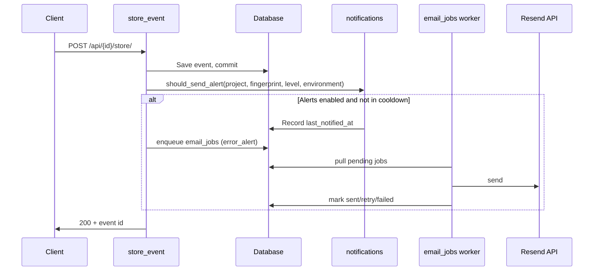

# Email alerts for errors

## Overview

When an error-level event is stored and the project has email alerts enabled, recipients are resolved (owner + configured recipients), and an email job is queued for delivery. Alerts are subject to cooldown controls to avoid flooding, including optional environment-level overrides.

## Architecture

- **Non-blocking and durable:** Ingest enqueues DB jobs; a worker processes jobs with retry/backoff.

## Recipients

- **Project owner** — `User.email` for the user who owns the project (`Project.owner_user_id`).
- **Additional emails** — Stored in `project_alert_recipients`; deduplicated with owner.
- **Environment recipients (optional)** — Stored in `project_alert_environment_recipients` and merged for matching environment.

## Components

- **Trigger:** `store_event` in `src/xrayradar_server/routers/api.py` (enqueue after commit).
- **Logic:** `src/xrayradar_server/notifications.py` — `get_alert_recipients`, `should_send_alert`.
- **Queue/worker:** `src/xrayradar_server/mail_jobs.py` — enqueue + processing + retry.
- **Settings:** Project-level (`project_alert_settings`, `project_alert_recipients`) plus optional env-level (`project_alert_environment_settings`, `project_alert_environment_recipients`).

## Plan limits

- **Free:** No email alerts. `get_alert_recipients` returns no one for projects owned by a Free user; GET alert-settings returns `enabled=False`, `min_cooldown_minutes=None`; PATCH with `enabled=True` returns 400.
- **Basic:** Email alerts allowed; minimum cooldown **10 minutes**.
- **Teams / Teams Pro:** Email alerts allowed; minimum cooldown **1 minute**.

## User API

- `GET /api/user/projects/{project_id}/alert-settings` — read project and environment-level alert settings.
- `PATCH /api/user/projects/{project_id}/alert-settings` — update project-level and optional environment-level settings.
