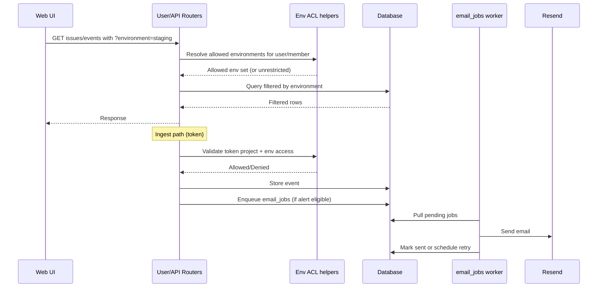

# Environments, Env ACL, and Notification Delivery

## Overview

This document describes project-scoped environment views, environment-level access control (Env ACL), and durable email delivery for alerts and auth/team emails.

Goals:

- Keep a single issue stream (same fingerprint) while allowing per-environment filtering.
- Restrict member/token visibility and ingest by environment when configured.
- Decouple email delivery from request latency with retriable, DB-backed jobs.

## Feature scope

### Environment views

- Frontend environment selector on:
  - `ProjectIssuesPage`
  - `IssueDetailPage`
- Selection persistence:
  - Query param (`?environment=<name>`) for shareable links
  - `localStorage` per project for sticky UX
- Backend endpoints accept `environment` (single value or CSV list), and apply filtering consistently.

### Environment access control

- User/member env ACL:
  - `project_member_environments(project_id, user_id, environment)`
  - No rows for a member means unrestricted access (default all envs).
- Token env ACL:
  - `token_project_environment_access(token_id, project_id, environment, revoked_at)`
  - No active rows for a token+project means unrestricted env access.
- Enforcement:
  - User read endpoints validate requested envs against allowed set.
  - Token ingest validates event environment against token env scope.

### Env ACL user flow in UI

- **Member env ACL (project settings):**
  - Owner opens project settings and manages member environment access in `ProjectSettingsModal`.
  - Members only see environments they are allowed to access in project/issue selectors.
- **Token env ACL (tokens page):**
  - Owner opens `/dashboard/tokens`, expands a token, then manages project access.
  - For each granted project, owner can open **Configure environments**.
  - Selection behavior:
    - No environments selected = unrestricted token env access for that project.
    - One or more selected = token is restricted to selected environments.
  - UI reads/writes:
    - `GET /api/user/tokens/{token_id}/projects/{project_id}/environments`
    - `PUT /api/user/tokens/{token_id}/projects/{project_id}/environments`

### Notifications separation

- `email_jobs` table stores durable send jobs (`pending/sent/failed`) with retry metadata.
- Worker utility (`process_pending_email_jobs`) processes pending jobs with exponential backoff.
- Error alerts are sent as cooldown-window digests (top issues in `[last successful send, trigger time]`).
- All major email categories are supported by the queue:
  - `error_alert`
  - `verification`
  - `password_reset`
  - `team_invite`
  - `post_verification_onboarding` — one-time “getting started” email sent after successful email verification (see [Onboarding](onboarding.md)).

## Data model additions

- `project_member_environments`
- `token_project_environment_access`
- `project_alert_environment_settings`
- `project_alert_environment_recipients`
- `email_jobs`

Migration: `alembic/versions/0012_env_acl_alert_env_and_email_jobs.py`.

## Request/response flow

## API and behavior notes

- Environment list endpoint:
  - `GET /api/user/projects/{project_id}/environments`
  - Returns environment name, last-30-day count, and `last_seen`.
- Read endpoints default behavior:
  - If `environment` is omitted, data is scoped to all environments the caller is allowed to see.
- ACL privacy behavior:
  - Requests for unauthorized envs return not-found style behavior (no env leakage).

## Alert routing by environment

- Base alert settings remain project-level (`project_alert_settings`).
- Optional environment-level overrides (available only for **Teams** and **Teams Pro** plans):
  - `project_alert_environment_settings` (enabled, cooldown override)
  - `project_alert_environment_recipients` (extra env-scoped recipients)
- Alert subject/body can include environment context to reduce operator confusion.
- Digest aggregation respects environment scope when the alert is triggered for a specific environment.

## Key files

- Backend:
  - `src/xrayradar_server/routers/user/issues.py`
  - `src/xrayradar_server/routers/user/_helpers.py`
  - `src/xrayradar_server/routers/api.py`
  - `src/xrayradar_server/deps.py`
  - `src/xrayradar_server/notifications.py`
  - `src/xrayradar_server/mail_jobs.py`
  - `src/xrayradar_server/models.py`
- Frontend:
  - `xrayradar-web/src/pages/ProjectIssuesPage.jsx`
  - `xrayradar-web/src/pages/IssueDetailPage.jsx`
  - `xrayradar-web/src/components/ProjectSettingsModal.jsx`
  - `xrayradar-web/src/pages/TokensPage.jsx`

