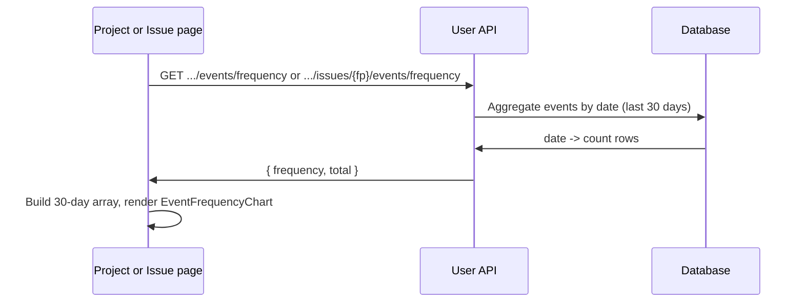

# Event frequency charts

## Overview

Event frequency is shown as a 30-day bar chart on the project page and on the issue detail page. Data is provided by aggregated backend endpoints so all events are counted (no limit).

## Data flow

1. **Project page:** Frontend calls `GET /api/user/projects/{project_id}/events/frequency`. Backend aggregates events by date (last 30 days) and returns `{ frequency: { "YYYY-MM-DD": count, ... }, total }`.
2. **Issue page:** Frontend calls `GET /api/user/projects/{project_id}/issues/{fingerprint}/events/frequency`. Same shape, filtered by fingerprint.
3. Frontend builds the last 30 days (all days present, zeros where no events), merges in backend counts, and passes the result to the shared `EventFrequencyChart` component.

## Components

- **Backend:** `src/xrayradar_server/routers/user_api.py` — `user_get_project_event_frequency`, `user_get_issue_event_frequency` (SQL aggregation by date, no row limit).
- **Frontend:** `xrayradar-web/src/components/EventFrequencyChart.jsx` — reusable chart; used by `ProjectIssuesPage.jsx` and `IssueDetailPage.jsx`.

## Diagram

