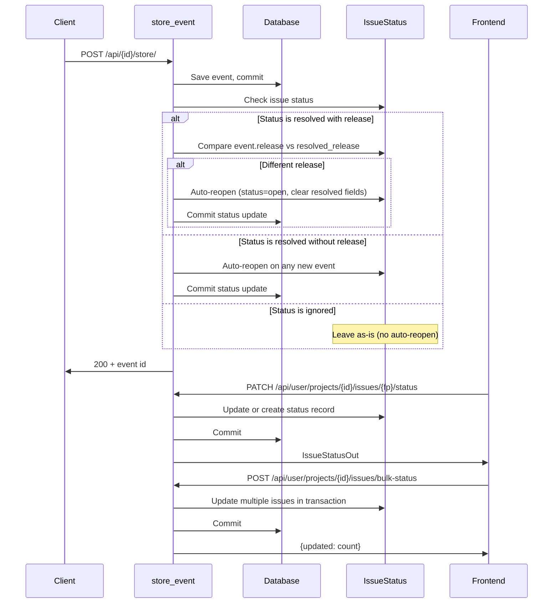
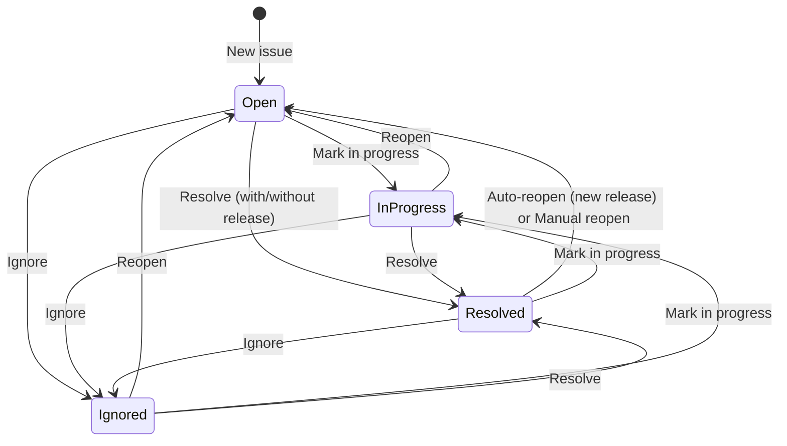

# Issue Status Management

## Overview

Issue status management tracks the lifecycle of issues (grouped by fingerprint) with support for Open, In Progress, Resolved, and Ignored/Muted statuses. Resolved issues can be tracked with release versions, enabling automatic reopening when issues recur in new releases.

## Architecture

## Data Model

### IssueStatus Table

- **Primary Key:** Composite `(project_id, fingerprint)`
- **Fields:**
  - `status`: Enum ("open", "in_progress", "resolved", "ignored") — indexed
  - `resolved_release`: String(64), nullable — release version when resolved (indexed)
  - `resolved_at`: DateTime, nullable — when issue was resolved
  - `resolved_by_user_id`: ForeignKey to users, nullable — who resolved it
  - `notes`: Text, nullable — optional notes about resolution/status
  - `created_at`: DateTime — when status was first set
  - `updated_at`: DateTime — last status change (indexed)

### Default Behavior

- Issues without a status record default to "open" when queried
- Status records are created lazily (on first status update or when explicitly queried)

## Auto-Reopen Logic

Auto-reopen occurs during event ingestion (`store_event` in `api.py`) after the event is committed:

1. **Resolved with release tracking:**
   - If `resolved_release` is set and new event has `release`:
     - Auto-reopen regardless of whether release matches (recurrence indicates fix didn't work)
     - Set status="open", clear resolved fields
   - If `resolved_release` is set but new event has no release → stay resolved (conservative)

2. **Resolved without release tracking:**
   - If `resolved_release` is null → auto-reopen on any new event

3. **Ignored status:**
   - Never auto-reopens (intentional suppression)

## API Endpoints

### Update Single Issue Status

**PATCH** `/api/user/projects/{project_id}/issues/{fingerprint}/status`

- **Request:** `IssueStatusUpdate` schema
  - `status`: enum ("open", "in_progress", "resolved", "ignored")
  - `resolved_release`: optional string (shown when status="resolved")
  - `notes`: optional string
- **Response:** `IssueStatusOut` with updated status
- **Behavior:**
  - Creates status record if none exists
  - Sets `resolved_at` and `resolved_by_user_id` when resolving
  - Clears resolution fields when changing to non-resolved status

### Bulk Update Status

**POST** `/api/user/projects/{project_id}/issues/bulk-status`

- **Request:** `BulkIssueStatusUpdate` schema
  - `fingerprints`: list of strings
  - `status`: enum
  - `resolved_release`: optional string
  - `notes`: optional string
- **Response:** `{updated: count}`
- **Behavior:** Updates multiple issues in a single transaction

### List Issues with Status

**GET** `/api/user/projects/{project_id}/issues?status={filter}`

- **Query params:**
  - `status`: optional filter ("open", "in_progress", "resolved", "ignored")
- **Response:** `list[IssueSummaryOut]` with status fields included
- **Behavior:**
  - Joins with `IssueStatus` table (left join, defaults to "open")
  - Filters by status if `status` query param provided
  - Includes `status`, `resolved_release`, `resolved_at` in response

## Frontend Components

### IssueStatusBadge

Reusable badge component displaying status with color coding:
- **Open:** Blue/gray
- **In Progress:** Yellow/orange
- **Resolved:** Green (with release indicator if applicable)
- **Ignored:** Gray/muted

### IssueStatusManager

Status management component for issue detail page:
- Current status display
- Status selector (dropdown)
- Conditional release input (shown when resolving)
- Notes textarea
- Save/Cancel actions

### ProjectIssuesPage Enhancements

- Status filter dropdown (All, Open, In Progress, Resolved, Ignored)
- Status badge column in issues table
- Bulk selection checkboxes
- Bulk action toolbar (Mark In Progress, Resolve, Ignore)

### IssueDetailPage Enhancements

- Status management section at top
- Resolution information display (release, date, notes)
- Auto-reopen notification banner

## Components

### Backend

- **Model:** `src/xrayradar_server/models.py` — `IssueStatus`
- **Migration:** `alembic/versions/0008_issue_status.py`
- **Auto-reopen:** `src/xrayradar_server/routers/api.py` — `store_event` (after commit)
- **Endpoints:** `src/xrayradar_server/routers/user/issues.py`
  - `user_update_issue_status` — PATCH endpoint
  - `user_bulk_update_issue_status` — POST endpoint
  - `user_list_issues` — updated with status join and filtering
- **Helper:** `_ensure_issue_status` — creates default "open" status if none exists
- **Schemas:** `src/xrayradar_server/schemas.py`
  - `IssueStatusUpdate`, `BulkIssueStatusUpdate`, `IssueStatusOut`
  - Updated `IssueSummaryOut` with status fields

### Frontend

- **Components:**
  - `xrayradar-web/src/components/IssueStatusBadge.jsx`
  - `xrayradar-web/src/components/IssueStatusManager.jsx`
- **Pages:**
  - `xrayradar-web/src/pages/ProjectIssuesPage.jsx` — status badges, filters, bulk actions
  - `xrayradar-web/src/pages/IssueDetailPage.jsx` — status management UI
- **API:** `xrayradar-web/src/utils/api.js`
  - `updateIssueStatus` — single update
  - `bulkUpdateIssueStatus` — bulk update
- **Styling:** `xrayradar-web/src/styles.css` — status badges, bulk actions, status manager

## Status Workflow

## Design Decisions

1. **Composite Primary Key:** `(project_id, fingerprint)` ensures one status per issue and efficient lookups.

2. **Lazy Status Creation:** Status records are created on first update, not when events are stored. This keeps the table lean for projects with many issues that never need status tracking.

3. **Release Comparison:** String-based comparison (no semantic versioning). Simple and flexible for any release naming scheme.

4. **Auto-Reopen Behavior:**
   - Resolved with release: Only reopens if different release (conservative)
   - Resolved without release: Reopens on any new event (aggressive)
   - Ignored: Never reopens (intentional suppression)

5. **Bulk Operations:** Transactional updates for consistency. All-or-nothing behavior.

6. **Status Filtering:** Applied client-side after fetching (for simplicity). Could be optimized with SQL filtering if needed.

## Related

- [Event ingest](event-ingest.md) — auto-reopen logic runs during event storage
- [Dashboard stats](dashboard-stats.md) — status can be used for filtering/grouping in future enhancements
