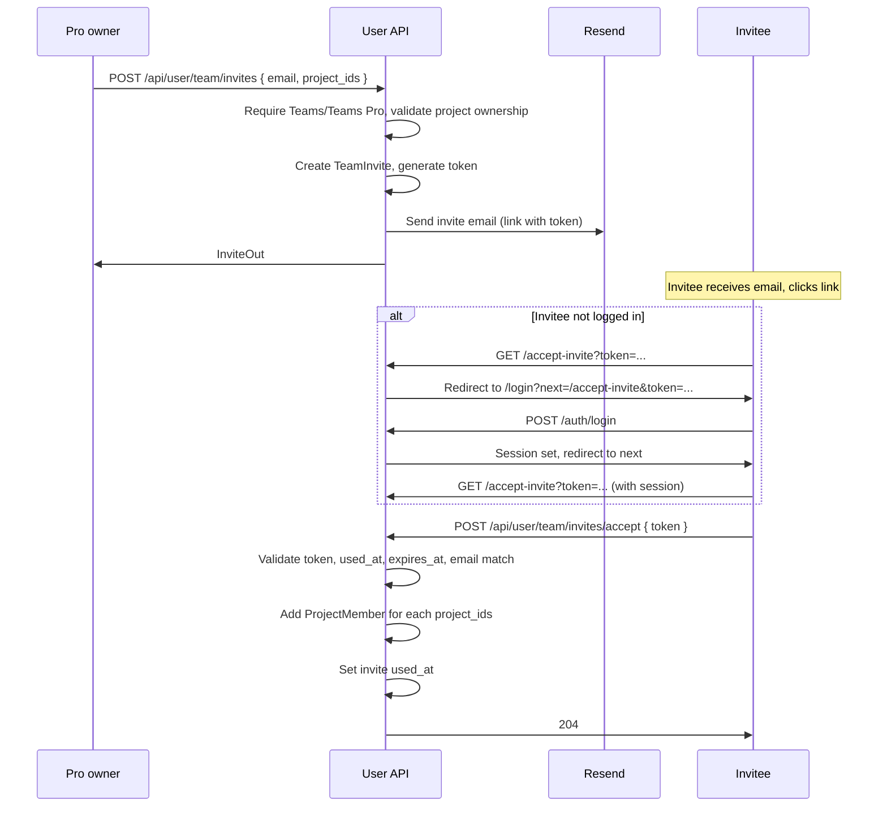

# Teams / Teams Pro access

## Overview

Team access allows users on the **Teams** or **Teams Pro** plan to share projects with other users (team members). A Teams account owner can invite users by email, assign them to specific projects, and revoke access. Members see assigned projects in their dashboard and can view issues, events, and alerts for those projects but cannot create projects or manage team membership.

There is no separate "organization" or "team" entity: the "team" is derived from users who have at least one `project_members` row for a project owned by the Teams user.

## Data model

### project_members

- **Table:** `project_members`
- **Primary key:** `(project_id, user_id)`
- **Columns:**
  - `project_id` — FK to `projects(id)` ON DELETE CASCADE
  - `user_id` — FK to `users(id)` ON DELETE CASCADE
- **Constraints:** Unique on `(project_id, user_id)`; a user cannot be added twice to the same project.
- **Semantics:** User `user_id` has read-only access to project `project_id`. Only projects whose **owner** has `plan` in `('Teams', 'Teams Pro')` may have members (enforced in API, not DB).

### team_invites

- **Table:** `team_invites`
- **Primary key:** `id` (serial)
- **Columns:**
  - `inviter_user_id` — FK to `users(id)` ON DELETE CASCADE
  - `email` — Invitee email (VARCHAR 320)
  - `token` — Unique token for the accept link (VARCHAR 64, unique index)
  - `expires_at` — Invite expiry (e.g. 7 days)
  - `created_at` — When invite was created
  - `used_at` — When invite was accepted (NULL until used)
  - `project_ids` — JSON array of project IDs to grant on accept (stored as TEXT/JSON for compatibility)
- **Semantics:** One-time invite. When the invitee accepts (logged in, email matches), they are added as `project_members` for each project in `project_ids` (that the inviter still owns). Invite is then marked `used_at`.

## Authorization

### Project access

- **Before:** Only the project **owner** could access a project in the user API (`require_owned_project`, `user_owned_project_ids_subq`).
- **After:** A user can access a project if they are the **owner** or a **project member**.
  - **Helper:** `require_project_access(db, user, project_id)` — returns the project or raises 404. Used for issues, tokens, alerts.
  - **Subquery:** `user_accessible_project_ids_subq(user_id)` — returns project IDs where the user is owner or in `project_members`. Used for project list and dashboard stats.

### Teams-only actions

Team management endpoints require `user.plan` in `('Teams', 'Teams Pro')` via `require_pro_user` dependency:

- List/add/revoke members, create/list invites, remove user from team.

Only the **project owner** may add or revoke members for that project; ownership is enforced with `require_owned_project` on the project.

## API endpoints

All team endpoints use session auth (`require_user`). Teams-only endpoints use `require_pro_user`.

| Method | Path | Description | Pro only |
|--------|------|-------------|----------|
| GET | `/api/user/team/members` | List users with access to any of your projects (with their project_ids) | Yes |
| POST | `/api/user/projects/{project_id}/members` | Add member by `user_id` or `email` | Yes (owner) |
| DELETE | `/api/user/projects/{project_id}/members/{user_id}` | Revoke user's access to this project | Yes (owner) |
| DELETE | `/api/user/team/members/{user_id}` | Remove user from all your projects | Yes |
| POST | `/api/user/team/invites` | Create invite (email, project_ids), send email | Yes |
| GET | `/api/user/team/invites` | List pending invites you sent | Yes |
| POST | `/api/user/team/invites/accept` | Accept invite (body: `{ "token": "..." }`); caller must be logged in, invite email must match | No |

## Multi-team membership (same user, multiple owners)

A single user (one account, one email) can be invited by **multiple different Teams account owners**. There is no restriction: the same email can receive invites from Owner A and Owner B.

- **Access:** `user_accessible_project_ids_subq(user_id)` returns every project where the user is the **owner** or a **project member** (from any owner). So the user gets access to all projects they were added to, regardless of which owner invited them.
- **Project list:** `GET /api/user/projects` returns a **single flat list** of all projects the user can access (owned + member of). Projects from different owners appear together; there is no grouping by "team" or owner.
- **Invited user experience:** The invited user does not see a separate "Team" page (that page is for **owners** to manage their invites and members). They simply see one Projects list that includes projects from every owner who added them. Each project has `is_owner: true | false` so the UI can show a "Member" badge on shared projects.

### Project list and usage

- **GET /api/user/projects** — Returns projects where the user is owner or member. Each project includes `is_owner: true | false`.
- **Dashboard stats** — Use `user_accessible_project_ids_subq` so members see stats for projects they can access.
- **Usage/limits** — Event storage limits remain tied to the **project owner** (no change to `get_user_event_count` / `check_user_event_limit`).

## Invite flow

## Accept-invite behavior

- **Authenticated:** Caller must have a session (`require_user`). Invite `email` must match the current user's email (case-insensitive).
- **Token:** Single-use; after accept, `used_at` is set. Expired invites (`expires_at < now`) return 400.
- **Projects:** Only projects that still belong to the inviter (`owner_user_id == inviter_user_id`) are applied; invalid IDs are skipped.
- **Idempotent:** If the user is already a member of a project, no duplicate row is inserted.

## Frontend

### Team page (`/dashboard/team`)

- **Visibility:** Link in dashboard nav only when `me.plan === 'Teams' || me.plan === 'Teams Pro'`.
- **Sections:**
  - Invite by email (email input + project checkboxes) → POST `/api/user/team/invites`.
  - Add member to project (project select + email) → POST `/api/user/projects/:id/members`.
  - Pending invites list (from GET `/api/user/team/invites`).
  - Team members table (email, projects, Revoke per project, Remove from team).

### Projects list

- Projects returned with `is_owner`. When `is_owner === false`, a "Member" badge is shown.

### Accept-invite route (`/accept-invite?token=...`)

- If not logged in: redirect to `/login?next=/accept-invite&token=...`. After login, user is sent back to accept-invite.
- If logged in: render `AcceptInvitePage`, which POSTs to `/api/user/team/invites/accept` with the token, then redirects to `/dashboard`.

### Login redirect

- Login page accepts `returnTo` query param (`next`). After successful login, redirect to `returnTo` if it is a path starting with `/`, otherwise `/dashboard`.

## Security and validation

- Every Teams team endpoint checks `user.plan` in `('Teams', 'Teams Pro')` and (where applicable) that the project is owned by the current user.
- Cannot add the project owner as a member (400).
- Invite tokens are single-use and expiry-checked.
- Accept endpoint ensures invite email matches the logged-in user to prevent token misuse.

## Key components

### Backend

- **Models:** `src/xrayradar_server/models.py` — `ProjectMember`, `TeamInvite`; `Project.members`, `User.project_memberships`, `User.team_invites_sent`
- **Migration:** `alembic/versions/0010_project_members_team_invites.py`
- **Helpers:** `src/xrayradar_server/routers/user/_helpers.py` — `require_project_access`, `user_accessible_project_ids_subq`; `require_owned_project` still used for owner-only actions
- **Router:** `src/xrayradar_server/routers/user/team.py` — all team and project-member endpoints
- **Deps:** `src/xrayradar_server/deps.py` — `require_pro_user`
- **Projects/Dashboard:** `routers/user/projects.py` (list with `is_owner`), `routers/user/dashboard.py` (stats use accessible subquery)
- **Schemas:** `src/xrayradar_server/schemas.py` — `TeamMemberOut`, `ProjectMemberAdd`, `InviteCreate`, `InviteOut`, `InviteAccept`; `UserProjectOut.is_owner`
- **Email:** Invite email sent via Resend in `team.py`; logged with `log_email(..., "team_invite", ...)`

### Frontend

- **Pages:** `xrayradar-web/src/pages/TeamPage.jsx`, `xrayradar-web/src/pages/AcceptInvitePage.jsx`
- **App/routes:** `App.jsx` — `/accept-invite` handling and login redirect; `DashboardRouter.jsx` — `/dashboard/team` → TeamPage
- **Layout:** `DashboardLayout.jsx` — Team link when `me?.plan === 'Teams' || me?.plan === 'Teams Pro'`
- **Projects:** `ProjectsPage.jsx` — Member badge when `is_owner === false`
- **Login:** `LoginPage.jsx` — `returnTo` support for post-login redirect

## Design decisions

1. **No organization table:** "Team" is inferred from project membership. Keeps the model simple and avoids org-level billing or roles for this iteration.

2. **Project-level membership only:** Access is per project. A Teams owner can add the same user to multiple projects; "Remove from team" removes them from all of the owner's projects.

3. **Owner vs member in list:** `is_owner` on project list lets the UI distinguish owned vs shared projects and show a Member badge.

4. **Usage limits stay with owner:** Event storage limits apply to the project owner's account. Members do not have their own limits for shared projects.

5. **Invite by email only:** Adding an existing user can be done by email (POST members with `email`) or by sending an invite; no separate "add by user_id" from UI for simplicity (API supports both).

6. **Accept requires matching email:** The user accepting the invite must be logged in and their email must match the invite; prevents one user from claiming another's invite.

## Related

- [Auth](auth.md) — Session and login; accept-invite uses session and login redirect
- [Usage limiting](usage-limiting.md) — Limits apply to project owner
- [Admin](admin.md) — Platform admin can set user plan to Teams or Teams Pro via PATCH `/api/admin/users/{id}/plan`
