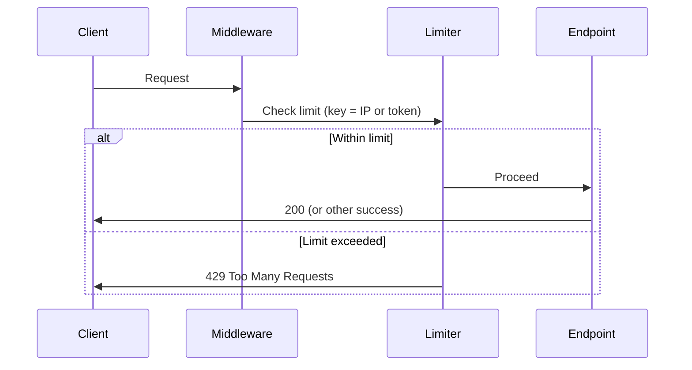

# Rate limiting

## Overview

Public endpoints are rate limited to reduce abuse, brute force, and resource exhaustion. Two scopes are used: **IP-based** limits for auth endpoints (signup, login, forgot-password, etc.) and **token-based** limits for event ingestion. The implementation uses [slowapi](https://github.com/laurentS/slowapi) with an in-memory store; limits are configurable via environment variables. When a limit is exceeded, the server returns **429 Too Many Requests** with an error message.

## Scopes and keys

| Scope | Key function | Endpoints | Default limit |
|-------|--------------|-----------|----------------|
| Auth | `get_rate_limit_key_auth` (client IP) | signup, login, forgot-password, reset-password, verify-email, resend-verification | 5/minute |
| Event ingest | `get_rate_limit_key_token` (API token) | `POST /api/{project_id}/store/` | 100/minute |

- **Auth**: Key is the client IP. IP is taken from `X-Forwarded-For` (first value) when behind a proxy, otherwise from `request.client.host`; fallback `127.0.0.1`. Each IP has its own bucket; different IPs do not share the auth limit.
- **Event ingest**: Key is the value of the `X-Xrayradar-Token` header (or `"no-token"` if missing). Each token has its own bucket; different tokens do not share the ingest limit.

## Flow

1. Request hits a rate-limited route (auth or event ingest).
2. **SlowAPIMiddleware** runs before the route. The limiter computes the key using the route’s `key_func` (IP for auth, token for ingest).
3. slowapi checks the in-memory store for that key and window. If under the limit, the request proceeds; if over, slowapi raises `RateLimitExceeded`.
4. The **exception handler** (`_rate_limit_exceeded_handler`) converts that to a **429** response with a JSON body containing a “rate limit” message.
5. Rate limit response headers are **disabled** (`headers_enabled=False` on the limiter), so no `X-RateLimit-*` headers are sent.

## Configuration

| Variable | Description | Default |
|----------|-------------|---------|
| `XRAYRADAR_RATE_LIMIT_AUTH` | Auth endpoints limit (e.g. `5/minute`, `10/hour`) | `5/minute` |
| `XRAYRADAR_RATE_LIMIT_EVENT_INGEST` | Event ingest limit per token | `100/minute` |

Format is `N/minute`, `N/hour`, or `N/day` (slowapi format).

## Key components

- **Limiter and key functions:** `src/xrayradar_server/rate_limit.py` — `limiter`, `get_client_ip`, `get_rate_limit_key_auth`, `get_rate_limit_key_token`
- **Constants:** `src/xrayradar_server/constants.py` — `RATE_LIMIT_AUTH`, `RATE_LIMIT_EVENT_INGEST` (from env)
- **App wiring:** `src/xrayradar_server/main.py` — `app.state.limiter = limiter`, `app.add_exception_handler(RateLimitExceeded, _rate_limit_exceeded_handler)`, `SlowAPIMiddleware`
- **Auth decorators:** `src/xrayradar_server/routers/user_auth.py` — `@limiter.limit(RATE_LIMIT_AUTH, key_func=get_rate_limit_key_auth)` on signup, login, forgot-password, reset-password, verify-email, resend-verification
- **Event ingest decorator:** `src/xrayradar_server/routers/api.py` — `@limiter.limit(RATE_LIMIT_EVENT_INGEST, key_func=get_rate_limit_key_token)` on `store_event`

## Endpoints covered

| Method | Path | Key | Limit |
|--------|------|-----|--------|
| POST | `/auth/signup` | IP | RATE_LIMIT_AUTH |
| POST | `/auth/login` | IP | RATE_LIMIT_AUTH |
| POST | `/auth/forgot-password` | IP | RATE_LIMIT_AUTH |
| POST | `/auth/reset-password` | IP | RATE_LIMIT_AUTH |
| GET | `/auth/verify-email` | IP | RATE_LIMIT_AUTH |
| POST | `/auth/resend-verification` | IP | RATE_LIMIT_AUTH |
| POST | `/api/{project_id}/store/` | Token | RATE_LIMIT_EVENT_INGEST |

`/auth/logout` and `/api/me` are **not** rate limited (logout is low-risk; `/api/me` is protected by session and not public).

## Storage and deployment

- **Storage:** slowapi’s default in-memory backend. Counters are per-process; they are not shared across multiple worker processes or instances.
- **Multi-worker / multi-instance:** Each process has its own buckets. With N workers, effective capacity per key is roughly N× the configured limit (e.g. 5/min per worker → 5N/min total for that key). For stricter global limits, use a shared store (e.g. Redis) via slowapi’s storage backend if supported, or put a reverse proxy / API gateway in front with its own rate limiting.

## Testing

- **Tests:** `tests/test_00_rate_limit.py` — auth 429 when exceeding limit, separate buckets per IP, signup/login/forgot-password limits, event ingest 429 per token, separate buckets per token, 429 response body contains “rate limit”, `get_client_ip` fallback.

## Relation to other features

- **Usage limiting** (see [usage-limiting.md](usage-limiting.md)): Plan-tier event caps (e.g. 5,000 for Free) are enforced **after** rate limiting. Rate limiting caps requests per minute; usage limiting caps total stored events per user.
- **Auth** (see [auth.md](auth.md)): Rate limiting on auth endpoints mitigates brute force and credential stuffing; it does not replace strong passwords or optional 2FA.
